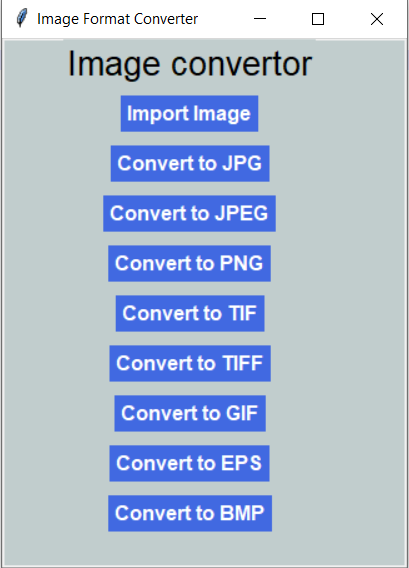

# Image-Format-Converter [](https://forthebadge.com)

<br>
A Image Format Converter GUI App Made Using Python 3.9.0 .
Hope You Will Like It and you can also use the code to make your own version.

## Requirements
1.  PIL
2.  tkinter

---

### Installing The PIL Module:
* For Linux: Open Terminal then type ```pip3 install PIL```
* For Windows: Open CMD, then type ```pip install PIL```

---
## Demo

